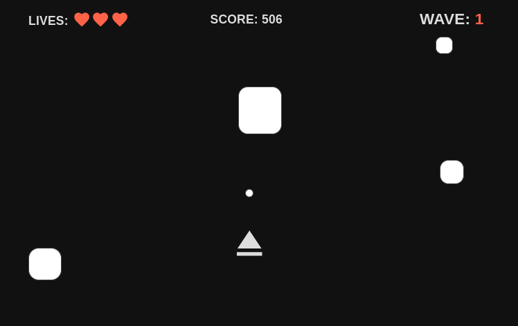

# Asteroids Game

Project 1 of SEI, an Asteroids based game.

# 💻 Click here to see my live project!

[Asteroids Project](https://github.com/Candangueira/Asteroid-project1)

# 📄 About

How to use my Asteroids.

-   WASD move the player.
-   Cursor aims the laser.
-   Left click in the mouse shoot the projectile.

# Add in-app screenshots.

✏️ Planning & Problem Solving
Talk about approach to the problem.
Add screenshots/drawings of doodles/plans during the planning phase.
Flow charts of app logic. Wireframing

# 🚀 Cool tech

Javascript, HTML and CSS.

# 😱 Bugs to fix 💩

-   Bugs in the movement, diagonals goes faster than straight lines.
-   If you dont move the cursor it doesnt aims.
-   The collisions in the Asteroids are a bit off.

## Buttons to not click too many times (cause its broken 😒)

-   Restart Button spawns too many Asteroids.

# 😭 Lessons learnt

-   I would focus on the essencial parts first, and leave the details and optimization for later.

# ✅ Future features

-   Add inercia.
-   Splitting asteroids when hit by a projectile.
-   Smoother movement.
